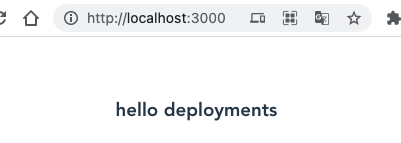

# 初始化 vue3+vite


## 安装

```bash
# 初始化项目
yarn create vite webapp --template vue-ts

cd webapp

## 安装依赖
yarn

## 启动查看 vue3 是否正常
yarn dev


## 安装 less 支持， 以后写样式用
yarn add less
```

## 清理环境

1. 删除 `/webapp/src/components` 下的 `HelloWorld.vue`。
并新建一个 `Deployment.vue`。 这里使用 vue3 的 `setup` 语法糖。

在 `<template>` 标签对中创建内容 `<h3>hello deployments</h3>`

```html
<template>
<h3>hello deployments</h3>

</template>

<script setup lang='ts'>
</script>

<style lang='less' scoped>
</style>
```

2. 修改 `/webapp/src/App.vue`, 将与 `HelloWorld` 相关的内容全部替换成 `Deployment`

```html
<template>
  <Deployment/>
</template>

<script setup lang="ts">
import Deployment from './components/Deployment.vue'
</script>
```

3. 运行 webapp 查看效果

```bash
yarn dev
```



朴实无华的界面。

