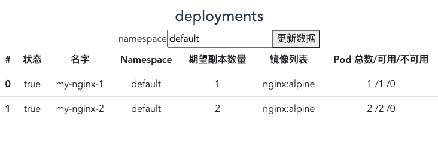
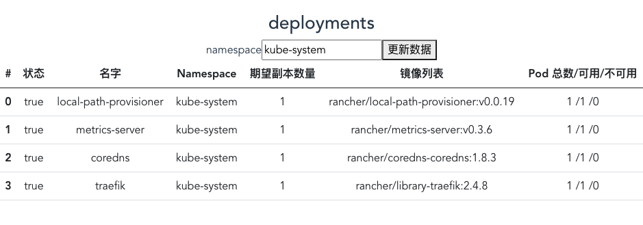

# 获取并展示 Deployments 信息

> tag: https://github.com/tangx/k8sailor/tree/feat/08-fetch-and-display-deployments






## 使用 Axios 请求 Deployments 数据

安装 axios 客户端

```bash
# 安装 axios
yarn add axios
```

创建 [/webapp/src/apis](/webapp/src/apis) 目录， 用于存放所有针对 k8sailor 后端的数据请求

### 使用 axios config 模式初始化一个客户端

[/webapp/src/apis/httpc.ts](/webapp/src/apis/httpc.ts)

axios config 模式可以创建一个 http 客户端，其中包含了各种各样的初始化参数， 使用这个模式就不用在每个请求中都写重复的内容了。


```ts
import axios from 'axios'

// 使用 config 模式
// https://github.com/axios/axios#config-defaults
let httpc = axios.create({
    baseURL:"http://127.0.0.1:8088/k8sailor/v0"
})

export default httpc
```

### 创建 deployments 的请求参数

[/webapp/src/apis/deployment.ts](/webapp/src/apis/deployment.ts)

有了公共的 `httpc` 之后， 在不同的 **组建** 中就可以直接 `import` 使用了。

> 注意: 在 `httpc.get()` 的时候， 只写了 `deployments` 的接口相对地址。 在发送请求是， axsio 会自动进行补全。

```ts
import httpc from './httpc'

// 获取所有 deployment 信息
// namespace 默认值为 defualt
// 使用 async await 解析内容
async function getAllDeployments(namespace = "default"): Promise<Deployment>{
    const resp = await httpc.get(`/deployments?namespace=${namespace}`)
    // console.log(resp.data)
    return resp.data
}
```

## server 端允许 cors 跨域

到这里会遇到 **跨域** 问题。 由于目前 **前后端** 是分离的，并且之前我们在 server 并没有相关代码允许跨域请求。 所有通过页面的请求 *暂时* 是无法拿到数据的。


跨域在 gin 中的实现其实就是 `gin.HandlerFunc`， 可以理解成一种中间件。

以下是跨域规则， 规则比较暴力， 极狐允许了全部请求， 在实际使用中， 可以进行按需调整。

```go
func cors() gin.HandlerFunc {
	return func(c *gin.Context) {
		method := c.Request.Method
		if method != "" {
			c.Header("Access-Control-Allow-Origin", "*") // 可将将 * 替换为指定的域名
			c.Header("Access-Control-Allow-Methods", "POST, GET, OPTIONS, PUT, DELETE, UPDATE")
			c.Header("Access-Control-Allow-Headers", "Origin, X-Requested-With, Content-Type, Accept, Authorization,X-Token")
			c.Header("Access-Control-Expose-Headers", "Content-Length, Access-Control-Allow-Origin, Access-Control-Allow-Headers, Cache-Control, Content-Language, Content-Type")
			c.Header("Access-Control-Allow-Credentials", "true")
		}
		if method == "OPTIONS" {
			c.AbortWithStatus(http.StatusNoContent)
		}
	}
}
```

接下来在 server 端应用规则， 允许跨域。

```go
// RegisterRoute 注册
func (s *Server) RegisterRoute(registerFunc func(rg *gin.RouterGroup)) {

	// 注册以服务名为根的路由信息，方便在 k8s ingress 中做转发
	base := s.engine.Group(s.Appname)

	// 针对 appname 下的路由，允许跨域
	base.Use(cors())

	// 注册业务子路由
	registerFunc(base)
}
```

这里并没有在 **根路由** 下允许， 而是在 `/:appname` 下允许。 

也就是说如下

```bash
# 允许跨域
/appname/deployments   
/appname/pods/:podname  

# 不允许跨域
/ping
```

## vue3 展示数据

使用 `reactive` 定义一个 **响应式** 数据

```html

<script setup lang='ts'>
import {reactive } from '@vue/reactivity'
import client,{ DeploymentItem } from '../apis/deployment'


let data = reactive({
  namespace:"default",
  error: "",
  items: [] as DeploymentItem[]
})

</script>
```

### 使用 onMounted 加载数据

`onMounted` 是 vue3 的生命周期钩子的其中一个, 在页面加载时执行。

> https://v3.vuejs.org/guide/composition-api-lifecycle-hooks.html

```html

<script setup lang='ts'>
import {reactive } from '@vue/reactivity'
import { onMounted } from '@vue/runtime-core'
// ...

onMounted(()=>{
  getAllByNamespace()
})
</script>
```

### 使用 v-for 显示数据

```html
    <tr v-for="(item,id) in data.items" key=:id>
      <th scope="row">{{ id }}</th>
      <td>{{ item.name }}</td>
<!-- 省略 -->
    </tr>
```
### 使用 v-if 进行条件渲染

在返回的数据中， 有两种状况:

1. 有错误， 没数据
2. 没错误， 有数据

因此设置了两个容器（错误与表格）， 使用 `v-if` 根据是否有错误消息决定是否展示这两部分容器

```html
<!-- 当数据异常的时候显示 -->
<div class="error-container" v-if="data.error">
    <!-- 省略 -->
</div>


<!-- 当数据正常的时候显示 -->
<table class="table" v-if="!data.error">
    <!-- 省略 -->
</table>
```

### 使用 v-model 绑定数据 

`v-model` 数据的双向绑定。
`v-model="data.source"` 是将 `data.source` 的值绑定到 **控件** 的 **value** 属性上。


```html
  <input type="text" placeholder="default" v-model="data.namespace">
```

### 使用 v-on 绑定事件

`@` 是 `v-on` 的语法糖， 因此`@click` 完全写法就是 `v-on=click`。 意思就是 **点击按钮** 触发 **getAllByNamespace** 方法。

```html
  <button @click="getAllByNamespace(data.namespace)">更新数据</button>
```

## 问题遗留

### 301 重定向遇到跨域问题。