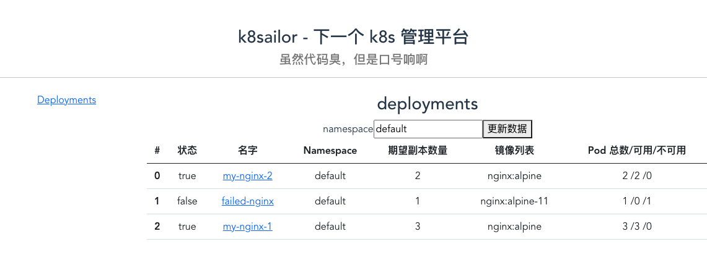

# 使用 vue-router 进行路由管理

> tag: https://github.com/tangx/k8sailor/tree/feat/10-vue-router-and-less



## 使用 vue-router 路由管理

安装 `vue-router` 支持参考 https://tangx.in/2021/09/28/vue3-vue-router/

1. 将默认的 [/webapp/src/App.vue](/webapp/src/App.vue) 作为最基本的入口， 除了引入 `Index.vue` 文件模块，不进行其他操作， 保持整洁。 其行为类似 golang 中的 `main.go`。

2. 创建 [/webapp/src/components/Index.vue](/webapp/src/components/Index.vue) 模块作为 index 入口文件， 也是主要的布局页面。
    1. 路由信息(`router-link`) 将放置在页面左侧
    2. 路由展示(`router-view`) 作为占位符放在右侧。

3. 所有数据展示类模块都放在 [/webapp/src/components/views](/webapp/src/components/views) 目录下。 所有内容将通过 `vue-router` 组件渲染， 展示在 `Index.vue` 模块的 `router-view` 区域。

## 使用 less 进行 Index 部署

less https://lesscss.org/ 是 css 的超级。 不仅语法与 css 相同。 而且支持 **嵌套** 书写， 可以直观的展现组件之间的层级关系。

`div` 本身是 **行元素** ， 即 **一个 div 就需要占用一行**。 在 css 布局中使用 `display: flex;` 后将脱离数据流， 悬浮并排在一起。 默认为水平排列。

配合使用 `flex-direction: column;` 将垂直排列。

```less

<style lang='less' scoped>

.body{
  // body 子元素悬浮水平排列
  display: flex;
  
  .body-left{
    width: 20%;
    margin: 5px;

    .link-container{
      // 垂直排列
      display: flex;
      flex-direction: column;

    }
  }
}
</style>

```

> flex: https://developer.mozilla.org/zh-CN./Web/CSS/CSS_Flexible_Box_Layout/Basic_Concepts_of_Flexbox


