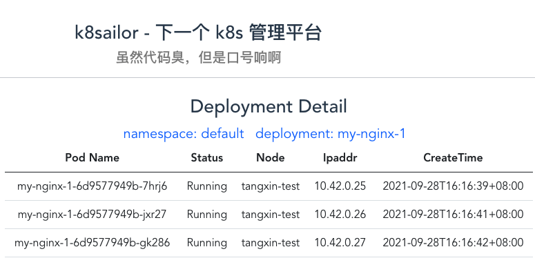

# 展示 deployment 详情页

> tag: https://github.com/tangx/k8sailor/tree/feat/11-display-deployment-detail



之前在后端已经将详情页的展示接口拆成了 **2个** 

+ 其一是根据 name 获取 **单个** deployment `/deployments/:name`
+ 其二是根据 deployment name 获取 **关联** 的 pods 信息 `/deployments/:name/pod`

页面展示就是两个接口请求与数据展示的简单操作， 和之前 deployment 页面一样， 没什么好说的。


## typescript 的 interface 衍生

不过， 在遇到第二个、第三个接口出现的时候， 发现之前对于 `deployment list` 返回的数据结构设计出现了问题。 

当时是将 `code, error` 两个字段直接内嵌到 `Deployment` 的接口设计之中。

```ts
export interface Deployment {
    code: number
    error: string
    data: DeploymentItem[] 
}

export interface DeploymentItem {
    images: string[]
    name: string
    namespace: string
    replicas: number
    status: {
        availableReplicas: number
        replicas: number
        unavailableReplicas: number
    }
}
```

现在发现， 如果需要在对 **单 Deployment** 和 **多 Pod** 进行返回的时候， 再重复这样将 **code, error** 耦合到响应接口里面就额外的冗余了。

因此， 在 [/webapp/src/apis/httpc.ts](/webapp/src/apis/httpc.ts) 中单独抽象了一个 **根响应接口** `HttpcResponse`， 包含了 code 和 error 字段。

```ts
// HttpcResponse 是 Server 端的基础响应结构体
// 具体的接口响应结果， 需要接口自行实现 HttpcReponse 的继承与 data 字段的覆盖
export interface HttpcResponse {
    code: number
    error: string
    data: Object
}
```

之后具体的接口响应接口， 都从 `HttpcResponse` 中衍生， 其行为只需要覆盖 `data` 字段即可。

```ts
// Deployment 定义 Deployment 数据字段
export interface Deployment {
    images: string[]
    name: string
    namespace: string
    replicas: number
    status: {
        availableReplicas: number
        replicas: number
        unavailableReplicas: number
    }
}


// DeploymentListResponse 继承并覆盖 data， 返回 deployment 的列表
export interface DeploymentListResponse extends HttpcResponse {
    data: Deployment[]
}

// DeploymentResponse 继承并覆盖 data， 返回 deployment 的单个字段
export interface DeploymentResponse extends HttpcResponse {
    data: Deployment
}
```

## vue3 获取路由信息

> https://next.router.vuejs.org/zh/api/#currentroute

在 `vue3 setup` 语法中， 倒入 `vue-router` 模块， 使用 `useRouter()` 方法获取到 `router` API。

就可以很方便的通过 `router.currentRouter` 获取到相关路由信息了。


```ts
// 路由表
const routes = [
    {
        path: "/deployments/:name",
        name: "DeploymentDetail",
        component: () => import('@/components/views/DeploymentDetail.vue')
    }
]
```


之前在路由表中定义路由信息的时候， 使用了 `/deployments/:name` 路径参数， 也是在这里的路由中获取。

```ts

import { useRouter } from "vue-router";

const router = useRouter()

// 获取 url 中的变量信息
const fetchUrlParams = function () {
  // 获取全路径
  // console.log("fullpath::::",router.currentRoute.value.fullPath);

  // 获取 query 参数
  // console.log("query::::",router.currentRoute.value.query);

  // 获取 路径参数
  // console.log("params::::",router.currentRoute.value.params);

  req.Params.name = router.currentRoute.value.params.name as string
  req.Params.namespace = router.currentRoute.value.query.namespace as string

}
```

