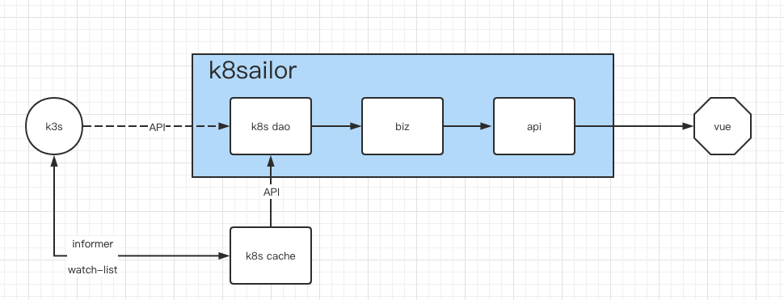

# k8s informer

> 深入理解 k8s informer: https://cloudnative.to/blog/client-go-informer-source-code/

从应用层面来说， 创建 informer 并启动之后就与 k8s cluster 创建了一个长链接并订阅了 **某个资源 Resource** 的变化。

至于订阅后得到的数据要怎么用完全取决于订阅者的业务设计。

## 项目案例

例如在本项目中

在本地创建了一个名为 `k8scache` 的存储空间， 使用 k8s informer 订阅了 `Deployment` 的数据并保存到了 **本地** [/internal/k8scache/deployment.go](/internal/k8scache/deployment.go) 中的 `DeploymentCache` 对象中。 并对外提供 `deployment` 的查询功能。

由于项目本地都存的是数据副本，只提供了 **查询 namespace 下的所有数据**， **根据 name 查询某个 deployment** 这样简单的功能。 原本 **k8s 通过 label 查询** 这样 **好用** 功能， 目前也就无法再提供了。

自此， biz 代码逻辑中与 Deployment 相关的查询使用的数据源都修改为 `k8scache`。 

