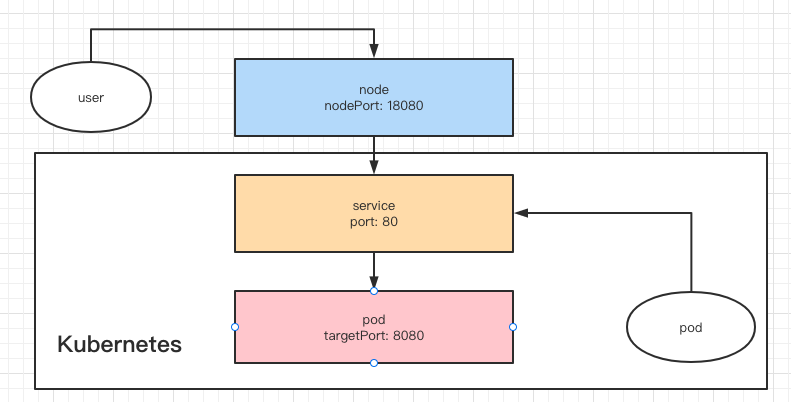

# 为 Deployment 创建 Service

## port, targetPort, nodePort

## headless service

对 statefuleset 有效， 对 deployment 无效

> https://kubernetes.io/zh/docs/concepts/workloads/controllers/statefulset/

## external name

