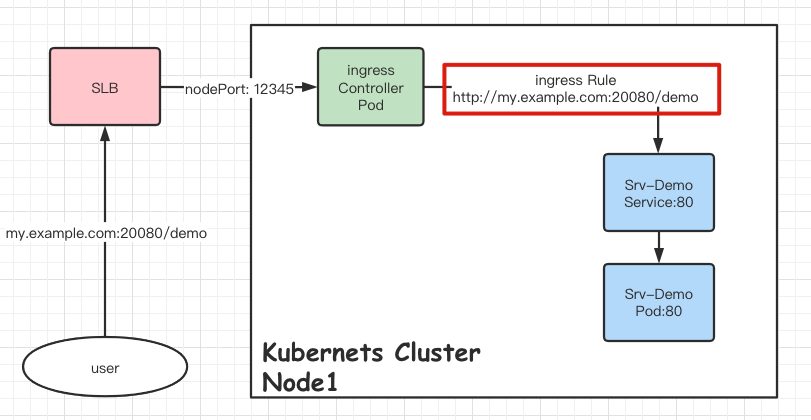

# 创建 ingress

> https://kubernetes.io/zh/docs/concepts/services-networking/ingress/

```bash
  # Create an ingress with a default backend
  kubectl create ingress ingdefault --class=default \
  --default-backend=defaultsvc:http \
  --rule="foo.com/*=svc:8080,tls=secret1" --dry-run -o yaml
```


```yaml
apiVersion: networking.k8s.io/v1
kind: Ingress
metadata:
  creationTimestamp: null
  name: ingdefault
spec:
  defaultBackend:
    service:
      name: defaultsvc
      port:
        name: http
  ingressClassName: default
  rules:
  - host: foo.com
    http:
      paths:
      - backend:
          service:
            name: svc
            port:
              number: 8080
        path: /
        pathType: Prefix   # 匹配方式
  tls:
  - hosts:
    - foo.com
    secretName: secret1
status:
  loadBalancer: {}
```


### 路径类型 

Ingress 中的每个路径都需要有对应的路径类型（Path Type）。未明确设置 pathType 的路径无法通过合法性检查。当前支持的路径类型有三种：

`ImplementationSpecific` ：对于这种路径类型，匹配方法取决于 IngressClass。 具体实现可以将其作为单独的 pathType 处理或者与 Prefix 或 Exact 类型作相同处理。

`Exact` ：精确匹配 URL 路径，且区分大小写。

`Prefix` ：基于以 / 分隔的 URL 路径前缀匹配。匹配区分大小写，并且对路径中的元素逐个完成。 路径元素指的是由 / 分隔符分隔的路径中的标签列表。 如果每个 p 都是请求路径 p 的元素前缀，则请求与路径 p 匹配。

说明： 如果路径的最后一个元素是请求路径中最后一个元素的子字符串，则不会匹配 （例如：/foo/bar 匹配 /foo/bar/baz, 但不匹配 /foo/barbaz）。


> 不建议使用 `ImplementationSpecific`，因为这个参数实现的功能取决于 **IngressClass / IngressController** ， 对用户 **1. 或不可控**， **2. 或认知盲点**。 如果后期换了一个 Controller 或换了一个人维护则可能出现异常。

事实上， 在 `kubectl create ingress` 的时候， 也是通过判断 rule 中的 uri 最后一个字符是否为 `*` 号确定使用使用哪种规则。 有 `*` 使用 prefix， 没有使用 exact 。


### API 请求体设计


#### endpoint 传递方式

因此我们采用 k8s 的规则， 使用 `*` 座位 PathType 的描述符。

```json5
### Post ingress
POST http://127.0.0.1:8088/k8sailor/v0/ingresses/my-nginx-5?namespace=default
Content-Type: application/json

{
    "endpoints":[
        "http://www.baidu.com/v0",
        "http://www.baidu.com/v1/api/*?backend=svc-google:443&tls=google-tls"
    ]
}
```

在 ingress 参数设计的时候， 考虑到 **URL 的可读性**， 

1. 直接将多个字段合并成了一个整体， 可以通过转换成 `url.URL` 进行解构，获取其中的关键字段。 
2. 在规则参数的传递上，为了更符合一个 [RFC 3986 URI](https://rfc-editor.org/rfc/rfc3986.html) 规定, 所以使用 `query` 进行参数传递。

```bash
http://www.example.com:20080/v1/api/*?backend=svc-google:443&tls=google-tls
```

1. host 不支持 IP 地址， 也就是说 `http://192.168.100.100/v1/api` 是不合法的。
2. 在 IngressRule 规则中， 不支持 **显式** 指定端口， 目前是通过 `http / https` 协议 **隐式** 实现的的 `80 / 443` 端口。
3. host 可以为 **空** 将转发所有请求。 host 为域名时只转发匹配域名的请求。


> https://pkg.go.dev/k8s.io/api@v0.21.4/networking/v1#IngressRule


这里的 port 其实并没有用， 保留设计只是为了 **标识** 外部入口使用的端口。 这种情况在云上遇到的不多， 但在一些实施项目上由于可能会遇到，例如域名没有备案。



#### backend service 默认值

除此之外， 在实现的时候 query 参数 `backend=svc-google:port` 进行了一些默认值处理

1. 如果不传递 backend， 将默认使用 `ingressName` 作为 `serviceName`。 这个主要是为了服务名称的统一性。 **ingress -> service -> workloads** 使用相同名字， 更具有识别性。

2. port 如果不传递， 默认是 80


> 注意: 在创建 service 的时候， port 是可以**具名**的， 这个 **port 名字** 也是能被使用的。 因此 `portName` 最好不要使用 **纯数字**， 避免造成混淆。

以下是对 ServiceBackendPort 的定义， 支持 `string 的 name` 和 `int32 的 Number`

```go
// k8s.io/api@v0.21.4/networking/v1/types.go
// ServiceBackendPort is the service port being referenced.
type ServiceBackendPort struct {
	// Name is the name of the port on the Service.
	// This is a mutually exclusive setting with "Number".
	// +optional
	Name string `json:"name,omitempty" protobuf:"bytes,1,opt,name=name"`

	// Number is the numerical port number (e.g. 80) on the Service.
	// This is a mutually exclusive setting with "Name".
	// +optional
	Number int32 `json:"number,omitempty" protobuf:"bytes,2,opt,name=number"`
}
```

