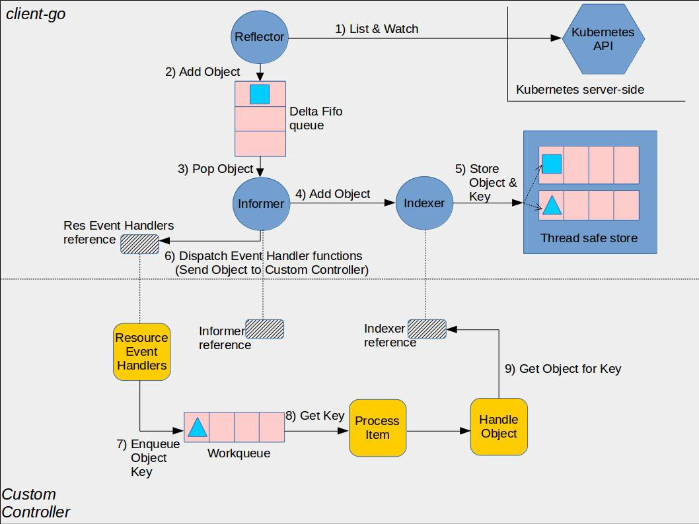
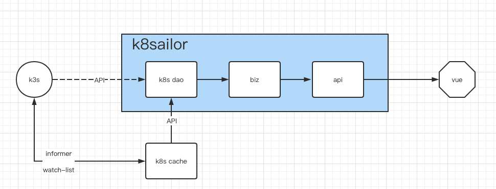

# k8s informer

> tag: https://github.com/tangx/k8sailor/tree/feat/13-k8s-informer



从应用层面来说， 创建 informer 并启动之后就与 k8s cluster 创建了一个长链接并订阅了 **某个资源 Resource** 的变化。

至于订阅后得到的数据要怎么用完全取决于订阅者的业务设计。

## Shared Informer Factory 共享机制

Informer 又称为 Shared Informer，表明是可以共享使用的，在使用 client-go 写代码时，若同一资源的 Informer 被实例化太多次，每个 Informer 使用一个 Reflector，会运行过多的相同 ListAndWatch（即图中的第一步），太多重复的序列化和反序列化会导致 k8s API Server 负载过重。

而 Shared Informer 通过对同一类资源 Informer 共享一个 Reflector 可以节约很多资源，这通过 map 数据结构即可实现这样一个共享 Informer 机制。


```go
// Start initializes all requested informers.
func (f *sharedInformerFactory) Start(stopCh <-chan struct{}) {
	f.lock.Lock()
	defer f.lock.Unlock()

	for informerType, informer := range f.informers {
		if !f.startedInformers[informerType] {
			go informer.Run(stopCh)
			f.startedInformers[informerType] = true
		}
	}
}
```

1. `informer.Run(stopCh)` : informer 在启动的时候需要传入一个 **通知停止的 channel** `stopCh <-chan struct{}`。 因此用户是可以 **主动** 关闭 informer 通道的。

2. 所有 `informer` 都是通过 `go` 协程跑在后台的。

### Shared Informer Factory 注册 infomers

上面提到， Shared Informer Factory 一个很重要的作用就是

1. 管理注册 Informer
2. 防止相同类型的 Infomer **重复注册**

[/pkg/confk8s/informer.go](/pkg/confk8s/informer.go) ， 在注册 Informer 的时候其实很还是很方便的。

```go
// WithEventHandlers 注册 handler
func (inf *Informer) WithEventHandlers(handlers ...InformerEventHandler) *Informer {
	for _, handler := range handlers {
		kind := handler.InformerKind()
		switch kind {
		case "deployment":
			inf.factory.Apps().V1().Deployments().Informer().AddEventHandler(handler)
		case "pod":
			inf.factory.Core().V1().Pods().Informer().AddEventHandler(handler)
		}
	}

	return inf
}
```

## informer event handler

所有的 informer handler 满足接口

```go
type ResourceEventHandler interface {
	OnAdd(obj interface{})
	OnUpdate(oldObj, newObj interface{})
	OnDelete(obj interface{})
}
```

即处理 **增** `OnAdd`, **改** `OnUpdate`, **删** `OnDelete` 三种事件。

## 项目案例

例如在本项目中



在本地创建了一个名为 `k8scache` 的存储空间， 使用 k8s informer 订阅了 `Deployment` 的数据并保存到了 **本地** [/internal/k8scache/deployment.go](/internal/k8scache/deployment.go) 中的 `DeploymentCache` 对象中。 并对外提供 `deployment` 的查询功能。

由于项目本地都存的是数据副本，只提供了 **查询 namespace 下的所有数据**， **根据 name 查询某个 deployment** 这样简单的功能。 原本 **k8s 通过 label 查询** 这样 **好用** 功能， 目前也就无法再提供了。

自此， biz 代码逻辑中与 Deployment 相关的查询使用的数据源都修改为 `k8scache`。 

```go
// GetDeploymentByName 通过名称获取 deployment
func GetDeploymentByName(ctx context.Context, input GetDeploymentByNameInput) (*Deployment, error) {

	/* k8s api 返回的数据 */
	// v1dep, err := k8sdao.GetDeploymentByName(ctx, input.Namespace, input.Name)

	/* 使用本地的 k8scache */
	v1dep, err := k8scache.DepTank.GetDeploymentByName(ctx, input.Namespace, input.Name)
	if err != nil {
		return nil, err
	}

	dep := extractDeployment(*v1dep)
	return dep, nil
}
```

### informer 启动

上面已经说了， 使用 informer 创建的是一个独立 **应用/模块**， 可以作为一个 **模块存在于应用内部**， 也可以作为一个 **独立的应用**。 

无论是怎么定义的， informer 的启动和关闭都 **必须要** 独立控制。

本项目中是作为一个模块, 在启动 http server 之前进行启动。 [/cmd/k8sailor/cmd/httpserver.go](/cmd/k8sailor/cmd/httpserver.go)

```go
var cmdHttpserver = &cobra.Command{
	Use:  "httpserver",
	Long: "启动 web 服务器",
	Run: func(cmd *cobra.Command, args []string) {
		// 启动 informer
		runInformer()

		// 启动服务
		runHttpserver()
	},
}

func runInformer() {

	clientset := global.KubeClient.Client()
	informer := global.KubeInformer.WithClientset(clientset)

	k8scache.RegisterHandlers(informer)

	informer.Start()
}
```

### 分层后代码实现的问题

其实上述 **切换数据源** 的实现是有问题的。

数据源的切换不应该是在 `biz` 中完成， 而是应该在 `k8sdao` 中进行。

1. 从逻辑上来说 `k8scache` 和 `k8s` 是一层的， 都是数据的提供者。
2. `DAO` 的含义是 **数据访问对象 `data access object`**， 其职责就是对 **来自不同数据源的相同数据** 执行 **适合自身业务逻辑的抽象和封装**


## 扩展阅读

> 深入理解 k8s informer: https://cloudnative.to/blog/client-go-informer-source-code/
