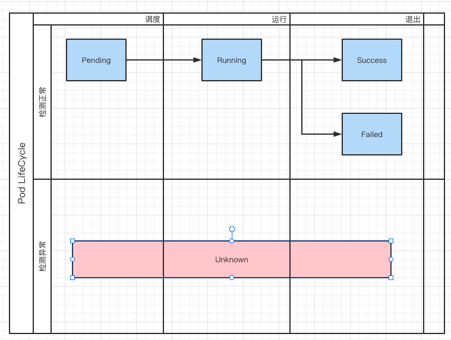

# Pod 的阶段(phase)与状态(status)

Pod 的生命周期 https://kubernetes.io/zh/docs/concepts/workloads/pods/pod-lifecycle/


Pod 的 Status 不是 Phase。

Pod 的 Status 需要根据  Pod 中的 `ContainerStatuses` 进行计算得到。

## Phase


阶段 | 描述
:-----|:-----------
`Pending`（悬决）| Pod 已被 Kubernetes 系统接受，但有一个或者多个容器尚未创建亦未运行。此阶段包括等待 Pod 被调度的时间和通过网络下载镜像的时间，
`Running`（运行中） | Pod 已经绑定到了某个节点，Pod 中所有的容器都已被创建。至少有一个容器仍在运行，或者正处于启动或重启状态。
`Succeeded`（成功） | Pod 中的所有容器都已成功终止，并且不会再重启。
`Failed`（失败） | Pod 中的所有容器都已终止，并且至少有一个容器是因为失败终止。也就是说，容器以非 0 状态退出或者被系统终止。
`Unknown`（未知） | 因为某些原因无法取得 Pod 的状态。这种情况通常是因为与 Pod 所在主机通信失败。




其中 `Running` 阶段包含了很多行为， 如 **1. 下载镜像，2. 启动并初始化，3. 对外提供服务**， 而通常认为的 Pod 处于正常服务状态（1. 能接受请求或发送请求， 2. pod 不退出） 只能该阶段的一部分，算 **3.对外提供服务**。


虽然 `kubectl` 工具使用 `kubectl get pod` 可以查看到 `Status` 这个状态。

```bash
→ kgp
NAME                            READY   STATUS             RESTARTS   AGE
my-nginx-6-5f55fd588f-pzn5m     1/1     Running            0          2d3h
new-nginx-04-5f94fffcdc-2gkbd   1/1     Running            0          44h
new-nginx-04-5f94fffcdc-wbnnw   1/1     Running            0          44h
new-nginx-05-799c589bdc-84tf2   1/2     CrashLoopBackOff   527        44h
new-nginx-03-69bd55dc6d-5c8d6   1/2     CrashLoopBackOff   472        40h
```

但 `k8s api` 中并没有直接给出 Pod 的实际状态， 虽然 Pod 的 Status 字段中有 **Reason 和 Message** 两个字段，但其内容一直为空，暂时没有发现有什么用处。

```go
// k8s.io/api@v0.21.4/core/v1/types.go
type PodStatus struct {
	// A human readable message indicating details about why the pod is in this condition.
	// +optional
	Message string `json:"message,omitempty" protobuf:"bytes,3,opt,name=message"`
	// A brief CamelCase message indicating details about why the pod is in this state.
	// e.g. 'Evicted'
	// +optional
	Reason string `json:"reason,omitempty" protobuf:"bytes,4,opt,name=reason"`
}
```


因此， 如果要实现类似 kubectl 展示 Pod Status 的情况， 就需要自己去 `PodConditions` 中去 **获取所有 Container 状态** 并分析、计算、返回。 顺便提一句， 这里并不知道 kubectl 是怎么实现的， **interface** 太多，不知道怎么追踪。 真失败 T.T 。


## 根据 Container 状态获取 Pod 状态

```go
// extractPod 转换成业务本身的 Pod
func extractPod(item corev1.Pod) *Pod {

	reason := ""
	message := ""
    
    // 计算 Pod 在 Phase Running 时候的真实 Status
	for _, status := range item.Status.ContainerStatuses {
		if !status.Ready && status.State.Waiting != nil {
			reason = status.State.Waiting.Reason
			message = status.State.Waiting.Message
			break
		}
	}

	return &Pod{
		Name:       item.Name,
		Namespace:  item.Namespace,
		Images:     PodImages(item.Spec),
		NodeName:   item.Spec.NodeName,
		NodeIp:     item.Status.HostIP,
		CreateTime: item.CreationTimestamp.Time,
		PodIP:      item.Status.PodIP,
		Status: PodStatus{
			Phase:   item.Status.Phase,
			Message: message,
			Reason:  reason,
		},
		Labels: item.Labels,
	}
}
```