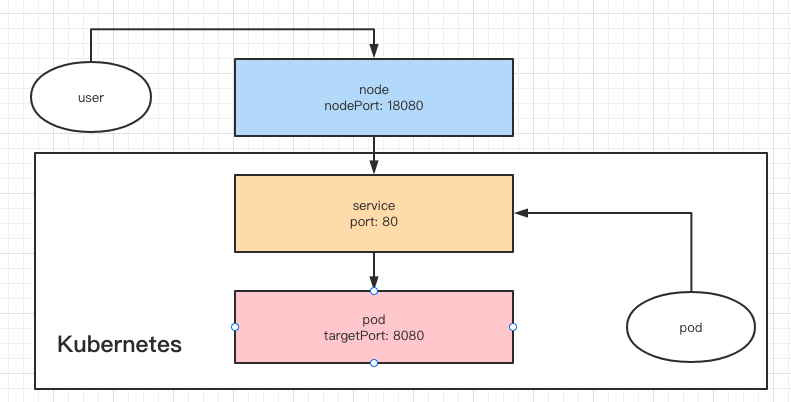
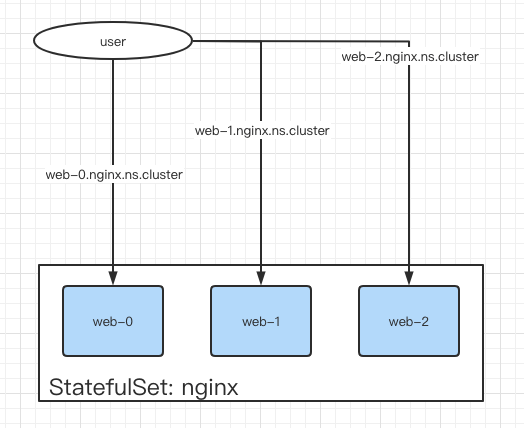
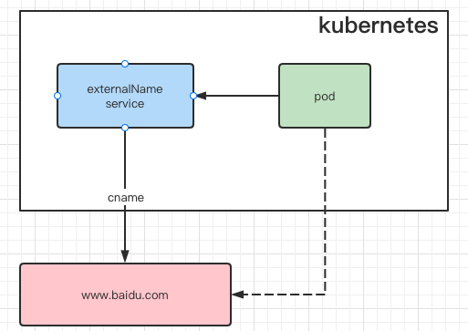

# 为 Deployment 创建 Service

> tag: https://github.com/tangx/k8sailor/tree/feat/19-create-service


> https://kubernetes.io/zh/docs/concepts/services-networking/service/#externalname

```bash
kubectl create service clusterip nginx-web --clusterip="port:targetPort"
kubectl create service clusterip nginx-web --clusterip="8082:80"
kubectl create service nodeport  nginx-web --clusterip="8081:80"
```

需要注意, 使用 `kubectl get service` 查看到的 `Ports` 的展示结果为 `port:nodePort`， 而 `targetPort` 不展示。

```bash
# kubectl get service
NAME                    TYPE        CLUSTER-IP      EXTERNAL-IP   PORT(S)         AGE
demo-nginx-nodeport-3   NodePort    10.43.181.29    <none>        80:32425/TCP    4s
```

## port, targetPort, nodePort



端口映射中的四个 **比较关键** 的要素:

1. name: 避免端口相同时，默认名字冲突
2. port: service 对外提供服务的端口
3. targetPort: service 指向的 pod 的端口， 即 pod 对外服务的端口。
4. nodePort: node 对外提供服务的端口， 通过 kube-proxy 修改 iptables 将流量转发到 service 上。

其中， targetPort 可以是 `string / int32` 的复合类型， 定义如下。

```go
// k8s.io/api@v0.21.4/core/v1/types.go

// ServicePort contains information on service's port.
type ServicePort struct {
	// Number or name of the port to access on the pods targeted by the service.
	// Number must be in the range 1 to 65535. Name must be an IANA_SVC_NAME.
	// If this is a string, it will be looked up as a named port in the
	// target Pod's container ports. If this is not specified, the value
	// of the 'port' field is used (an identity map).
	// This field is ignored for services with clusterIP=None, and should be
	// omitted or set equal to the 'port' field.
	// More info: https://kubernetes.io/docs/concepts/services-networking/service/#defining-a-service
	// +optional
	TargetPort intstr.IntOrString `json:"targetPort,omitempty" protobuf:"bytes,4,opt,name=targetPort"`
}
```

在 **apimachinery`(k8s.io/apimachinery@v0.21.4/pkg/util/)`** 包中， 提供了很多针对 k8s 对象的常用方法。 

### 解析 port

为了能简化 api 请求的参数， 因此对 clusterIp 和 nodePort 使用了符号表示： 默认为 clusterIp， 如果有 **叹号`!`** 则为 nodePort。

```go
port    // clusterIp, port 与 targetPort 一致
port:targetPort // clusterIp, port 与 targetPort 可能不一致

!port:targetPort // nodeport, 端口号随机: port 与 targetPort 可能不一致
!nodePort:port:targetPort // nodeport, 指定端口号, 端口可能因为被使用而创建失败
```


## headless service

对 statefuleset 有效， 对 deployment 无效

> https://kubernetes.io/zh/docs/concepts/workloads/controllers/statefulset/



使用 `headless` 之后， k8s 将不再创建 `service` 进行 pod 的负载均衡。 取而代之的是 **DNS** 将每个 pod 直接解析暴露， 域名规则 `podName.serviceName.namespace.Cluster`。

> 注意: statefuleSet 对与绑定的 serviceName 是有强力约束的。 只有匹配名字的 service 才能提供响应的服务。

```yaml
apiVersion: apps/v1
kind: StatefulSet
metadata:
  name: web
spec:
  selector:
    matchLabels:
      app: nginx 
  serviceName: "nginx" # 约束只能匹配名为 `nginx` 的 service
  replicas: 3
  template:
  # .... 省略
```

### 解析 Headless Port

```bash
kubectl create service clusterip my-nginx-web  --clusterip="None" --tcp=8088:80
```

从 kubectl 的命令中可以看到， `Headless Service` 可以被认为 `clusterip` 的一个子类， 其特殊之处就是 `ClusterIp: None`

鉴于此， 对之前的 Port 规则进行了一定扩展。 

规则基本类似， 采用了的新的符号 `#` 表示 Headless 服务。 `#` 在很多地方表示注释， 注释对外看不见，因此用以表示 `Headless`。

```go
#port:targetPort // headless 
```

本身 **NodePort 和 Headless** 就是不兼容的， 由于 `#, !` 在同一个位置， 也一定程度上避免了 **误写**


## external name

externalName service 就是 k8s 集群通过 coredns 实现的 **CNAME** 服务， 从而实现了 **在集群内部不依赖外部地址** 的内聚效果。

无论依赖资源地址是否发生变化（例如 迁移）， 客户端服务都不需要进行任何变更，只需要通过外部配置更新 service 的 externalName 即可完成切换。 



```bash
kubectl create service externalname my-ns --external-name www.baidu.com
```

```yaml
# kgs my-ns -o yaml
apiVersion: v1
kind: Service
metadata:
  labels:
    app: my-ns
  name: my-ns
  namespace: default
spec:
  externalName: www.baidu.com
  # selector:   # external 是不需要选择器的
  #   app: my-ns
  sessionAffinity: None
  type: ExternalName
```

通过 ping 命令可以看到， `my-ns` 和 `www.baidu.com` 结果是一样的。

```bash
# ping my-ns
PING www.a.shifen.com (110.242.68.4) 56(84) bytes of data.
64 bytes from 110.242.68.4 (110.242.68.4): icmp_seq=1 ttl=48 time=12.2 ms
64 bytes from 110.242.68.4 (110.242.68.4): icmp_seq=2 ttl=48 time=12.1 ms

# ping www.baidu.com
PING www.a.shifen.com (110.242.68.3) 56(84) bytes of data.
64 bytes from 110.242.68.3 (110.242.68.3): icmp_seq=1 ttl=48 time=11.2 ms
64 bytes from 110.242.68.3 (110.242.68.3): icmp_seq=2 ttl=48 time=11.2 ms
```

### 解析 externalName

由于 externalName 是完全的 DNS 行为。 1. 没有 pod 映射， 2. 也不需要 label selector 选择后端的提供服务的 Pod。 因此， 之前的 **port:targetPort** 规则也就用不上了。

对于 externalName 引入了新的符号 **at `@`** ， `@` 本身也有 **到、去** 目的地的意思。

```go
@external.name
```


## 总结

```bash
# k create service --help
Available Commands:
  clusterip    Create a ClusterIP service.
  externalname Create an ExternalName service.
  loadbalancer 创建一个 LoadBalancer service.
  nodeport     创建一个 NodePort service.
```

自此 kubectl 创建 service 常用的几个子命令已经实现了。

1. clusterip:
    + normal: `port:targetPort`
    + headless: `#port:targetPort`
2. externalname: `@external.com`
3. nodeport:
    + 指定 nodePort 端口: `!nodeport:port:targetPort`
    + 随机 nodePort 端口: `!port:targetPort`

### demo

services 中的参数互斥， 不能共用。

```bash
### CREATE servcie , Headless
POST http://127.0.0.1:8088/k8sailor/v0/services/demo-nginx-211?namespace=default
Content-Type: application/json

{
    "services":[
        "80:8088",         # clusterip
        "#80:80",          # headless
        "!31234:80:8088",  # nodeport
        "@www.baidu.com",  # external name
    ]
}
```

